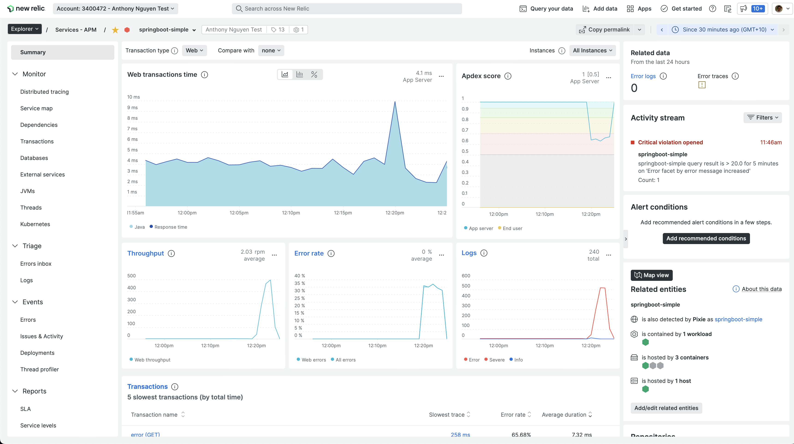
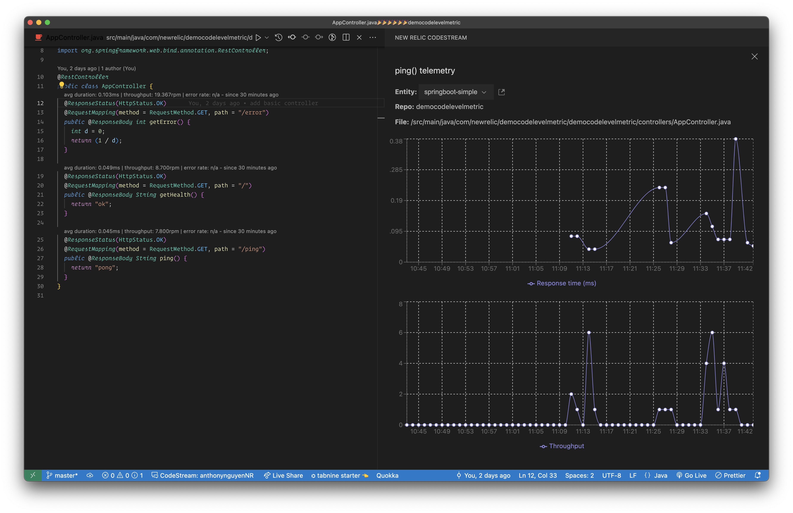

# See Code Level Metrics inside you IDE with CodeStream and NewRelic

## Run the app locally using VSCode

```bash
./mvnw spring-boot:run

# navigate to http://localhost:8080 or http://localhost:8080/error or http://localhost:8080/ping
```

## build docker image

```bash

# build docker image
docker buildx build . --platform linux/amd64 -t anthonynguyen334/springboot-simple --progress=plain

# tag
docker tag anthonynguyen334/springboot-simple anthonynguyen334/springboot-simple:withapm

# push
docker push anthonynguyen334/springboot-simple:withapm
```

## deploy the app to k8s

```bash
# deploy to your k8s cluster
kubectl create namespace sock-shop
kubectl apply -f k8s.yaml -n sock-shop

# get public IP address of the service
kubectl get service --watch --namespace=sock-shop

# make sure you connect to it
curl http://<YOURPUBLICIP>/error

# install https://github.com/rakyll/hey
brew install hey

# load test the Flask API
hey -n 2000 http://<YOURPUBLICIP>/ping
```

## Step 2: Add newrelic apm Agent

```bash
# get your ingest license at one.newrelic.com
# mac/ linux
YOUR_NR_INGEST_API=<Ingest Key>

# windows
set YOUR_NR_INGEST_API=<Ingest Key>

# Set required env variables
kubectl set env deployment/springboot-simple \
    NEW_RELIC_LICENSE_KEY=$YOUR_NR_INGEST_API \
    NEW_RELIC_LOG_FILE_NAME=STDOUT \
    NEW_RELIC_APP_NAME=springboot-simple \
    NEW_RELIC_DISTRIBUTED_TRACING_ENABLED=true \
    --namespace=sock-shop

# restart the deployment
kubectl rollout restart deployment springboot-simple -n sock-shop

# browse http://<YOURPUBLICIP>/ or http://<YOURPUBLICIP>/ping or http://<YOURPUBLICIP>/error
# go to NR One, you should see your app under APM
```



## Step 3: Connect CodeStream and view Code Level Metrics

```bash
# install latest version of Codestream extension for VSCode and connect to NR One using User key
# reload Vscode and open this repository
# make sure you install the python extension for VSCode

# install k6 (https://k6.io/docs/getting-started/installation/)
brew install k6

# in VSCode , open app.py file, then in the background, run the load tests
k6 run -e PUBLIC_IP=<YOURPUBLICIP> loadtest.js
```

-   you should see this after a minute or two
    
